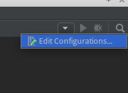

# Step 1: Set Up the Basic Django Project Structure
We will start by installing requirements and setting up the project.

## Pre-Requesits
Make sure you have the commands `virtualenv` and `python` (version 3.4 or later) installed.

For [Pillow](https://python-pillow.org/) (a third party library for image uploads in Django) to work properly, you need to install some 
extra tools (mainly libjpeg and zlib). See [this site](http://pillow.readthedocs.io/en/3.1.x/installation.html#building-on-linux) for details.

## Installing Python Requirements and Setting Up the Virtual Environment
Create a directory (in this example we will stick to the project name `django-rest-imageupload-example`), 
a [virtual environment](http://docs.python-guide.org/en/latest/dev/virtualenvs/) with Python 3.4 and 
install requirements:
```bash
mkdir django-rest-imageupload-example # create directory for our project
cd django-rest-imageupload-example
virtualenv -p python3.4 venv # create a virtual Python 3.4 environment
source venv/bin/activate # activate the venv
pip install django djangorestframework markdown django-filter pillow # install requirements
```

Using `pip freeze` you should see the list of installed packages within this virtual environment:
```
Django==1.10
Markdown==2.6.6
Pillow==3.3.1
django-filter==0.14.0
djangorestframework==3.4.6
```

## Creating our Django Project
*Note*: Do not use your IDE to create the project! Creating the project _manually_ will provide us with a much clearer project structure.

We can create the Django project by executing the following command in a shell:
```bash
django-admin startproject django_rest_imageupload_backend
```

You should see the following directory structure:

 * `django-rest-imageupload-example` (root folder)
     * `django_rest_imageupload_backend` (new Django project folder)
         * `django_rest_imageupload_backend` (the main Django app)
         * `manage.py` (Djangos manage.py command)
     * `venv` (virtual environment)

Now open the main folder `django-rest-imageupload-example` as a project in an editor of your choice
(we recommend the free [PyCharm community edition](https://www.jetbrains.com/pycharm/download/#section=linux), but a simple text
editor will do the trick too).

If you are using Pycharm, you should see that the virtual environment (in the `venv` folder) has already been 
determined to be the Python interpreter of choice. If you are using other editors that are capable of providing
code checks and completion, make sure to use the Python interpreter in the `venv/bin` subdirectory.

Out of my personal preference, I rename the place where the _main Django app_ resides (currently
`django_rest_imageupload_backend`) to something more generic like `backend_app`. This can either be done manually, 
by renaming the folder and replacing all occurrences of `django_rest_imageupload_backend` with `backend_app`, or using
PyCharms _Refactor/Rename_ utility. 

You should now have the following directory structure:

 * `django-rest-imageupload-example` (root folder)
     * `django_rest_imageupload_backend` (new Django project folder)
         * `backend_app` (renamed main Django app)
         * `manage.py` (Djangos manage.py command)
     * `venv` (virtual environment)

Another useful feature of Pycharm is that you can define the main source directory. 
In this case we want to define the `django_rest_imageupload_backend` directory as the 
_sources root_ in PyCharm, by right-clicking it and selecting _Mark directory as_ and _Sources root_.


Another useful feature of Pycharm is that you can _run your code_ (in this case the 
[Django dev server](https://docs.djangoproject.com/en/1.10/intro/tutorial01/#the-development-server)):
 
 1. Open the _run configuration_ on the top right of the window (to the left of the currently grayed out _Play_ icon).
    
 1. Click on _Edit configuration_
 1. A new dialog will apear. Create a new Python configuration by clicking on the plus icon on the top left.
 1. As a script, select the `manage.py` script in `django-rest-imageupload-example/django_rest_imageupload_backend/`
 1. Insert `runserver` as _Script parameters_ 
 1. The current working directory should have been determiend automatically to be `django-rest-imageupload-example/django_rest_imageupload_backend` without the trailing slash
 1. The python interpreter should be Python 3.4 in your virtual environment `venv`
 1. Give the run configuration a good name (e.g., *Django Run Server*) 
 1. Optional, but recommended: Make a tick at _Single instance only_, avoiding the django server to be ran more than once
 1. Hit apply button 8save it)
 1. Run it
 
Alternatively, you can just run the following command from shell (assuming that you are in the main folder of this project)
```bash
cd django_rest_imageupload_backend
python manage.py runserver
```

If everything went according to our plans, you should the following message (either in PyCharm or in a shell):
```
Performing system checks...

System check identified no issues (0 silenced).

You have 13 unapplied migration(s). Your project may not work properly until you apply the migrations for app(s): admin, auth, contenttypes, sessions.
Run 'python manage.py migrate' to apply them.
August 16, 2016 - 17:02:53
Django version 1.10, using settings 'backend_app.settings'
Starting development server at http://127.0.0.1:8000/
Quit the server with CONTROL-C.
```


Looks like we have 13 unapplied [migrations](https://docs.djangoproject.com/en/1.10/topics/migrations/)! Let's quickly fix them by running the following command in a shell:
```bash
python manage.py migrate
```


You can try to access [http://127.0.0.1.8000]() in a browser, but you will not be able to see much, except for a message
telling you that you that _It worked!_. However, Django comes with a handy [admin panel](https://docs.djangoproject.com/en/1.10/ref/contrib/admin/), which you can 
access by going to [http://127.0.0.1:8000/admin/](). Before you do that, you will have to create a superuser. Django
has packed this process in another command:
```bash
python manage.py createsuperuser
```
Enter a username and a password. You can leave the e-mail blank for now. Once this is done, you should be able to use
those credentials to log in into the admin panel, which will provide the following two sections (for now): `Groups` and 
`Users`. 

