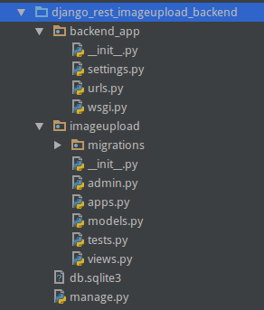
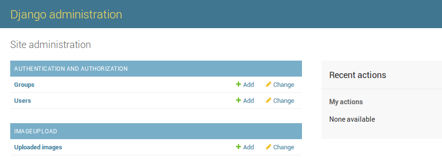

# Step 2: Create the `UploadedImage` model and migrations
Now that we have the basics for our Django project out of the way, we can create our image upload application. From now on we will assume
that we are working on the Django project directory `django_rest_imageupload_backend`.

## Create a new app
What, another app? Yes (we will create even more)! So far we only created the basic project structure, and `backend_app` will just be a place
where we put our configuration etc... Separating our project into multiple apps makes a lot of sense if you want to re-use your code later.

First of all, we need to create a Django app that will represent our database model (amongst some basic logic):
```bash
python manage.py startapp imageupload
```
The directory structure should now look like this:
 * `django-rest-imageupload-example`
     * 

In the just created `imageupload` we can now create our main model in `imageupload/models.py` as follows:
```python
from django.db import models # import the Django models namespace


# Our main model: Uploaded Image
class UploadedImage(models.Model):
    image = models.ImageField("Uploaded image") # stores the filename of an uploaded image
```


## Configuration
We need to configure our `backend_app` to include the new `imageupload` app and also 
define `MEDIA_ROOT` aswell as `MEDIA_URL` (both needed for storing and serving uploaded images) in `backend_app/settings.py`:
```bash

# in the INSTALLED_APPS section
INSTALLED_APPS = [
    ...
    'imageupload',
]

...

# at the bottom of settings.py
MEDIA_ROOT = os.path.join(BASE_DIR, '..', 'uploaded_media')
MEDIA_URL = '/media/'
```
Please note that we have set the `MEDIA_ROOT` to something outside of the django root directory on purpose

That's it, our `backend_app` is now aware of our new model. Though the database still needs to be made aware of the new model...

## Migrate (or: telling the database about our new model)
We can now proceed by creating the database migrations based on our new model:
```bash
python manage.py makemigrations
```
This will print the following message:
```
Migrations for 'imageupload':
  imageupload/migrations/0001_initial.py:
    - Create model UploadedImage
```

Now we need to execute this migration, storing changes in our local database:
```bash
python manage.py migrate
```
This will print the following message:
```
Operations to perform:
  Apply all migrations: admin, auth, contenttypes, imageupload, sessions
Running migrations:
  Rendering model states... DONE
  Applying imageupload.0001_initial... OK
````

Finally we want the new model `UploadedImage` to appear in the Django admin panel, therefore we need to edit `imageupload/admin.py`:
as follows:
```python
from django.contrib import admin
from imageupload.models import UploadedImage

# Register your models here.
admin.site.register(UploadedImage)
```


## Admin Panel
Go to the Django admin panel at [http://127.0.0.1:8000/admin/]() (or just refresh the page if you already have it opened).
You should see the new `Uploaded Images` model. 


Try adding pictures using *Add*. You will quickly find out that uploading the picture is working fine, 
and it also appears in the `uploaded_media/` (or whatever defined as `MEDIA_ROOT` in `settings.py`) folder, but you can not
view those pictures. This is because Django
[https://docs.djangoproject.com/en/1.10/howto/static-files/#serving-files-uploaded-by-a-user-during-development](does not serve the media files by default) 
(and you should not serve them directly in a production setup either). 

To overcome this problem we need to edit `backend_app/urls.py` as follows:
```python
from django.conf.urls import url
from django.contrib import admin
from django.conf import settings
from django.conf.urls.static import static

urlpatterns = [
    url(r'^admin/', admin.site.urls),
] + static(settings.MEDIA_URL, document_root=settings.MEDIA_ROOT)
```

