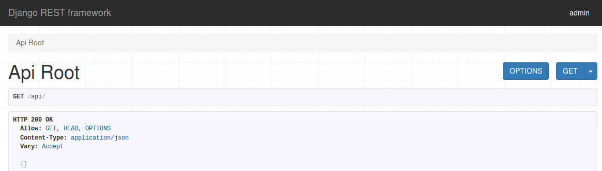
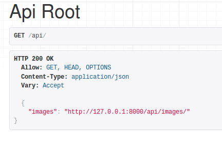

# Step 3: Create a Basic RESTful Endpoint for `UploadedImage`
So far we have only created the model and tested uploading some images via the admin panel. However, the core of this project is not 
going to be the admin panel, but the RESTful endpoint. 

## Create the REST app
Create a new Django app called `imageupload_rest`:
```bash
python manage.py startapp imageupload_rest
```

The directory structure should now look like this:
 * `django-rest-imageupload-example`
     * `django_rest_imageupload_backend`
         * `backend_app`
         * `imageupload`
         * `imageupload_rest`
         * `manage.py`
     * `venv`

Make sure to add `imageupload_rest` as well as `rest_framework` in `backend_app/settings.py` in the following order:
```python
INSTALLED_APPS = [
    ...
    'rest_framework',    
    ...
    'imageupload',
    'imageupload_rest',
]
```

I like to keep my projects clean and minimalistic. Therefore I recommend getting rid of the following files/folders:

 * `imageupload_rest/migrations/`
 * `imageupload_rest/admin.py`
 * `imageupload_rest/models.py`
 * `imageupload_rest/views.py`
 
However, we will need a way of defining URLs, therefore we need to create `imageupload_rest/urls.py` with the following content:
```python
from django.conf.urls import url, include
from rest_framework import routers

router = routers.DefaultRouter()

# Wire up our API using automatic URL routing.
# Additionally, we include login URLs for the browsable API.
urlpatterns = [
    url(r'^', include(router.urls)),
]

```

Last but not least, we have to link the new `imageupload_rest/urls.py` with the existing `backend_app/urls.py` by adding the following code:
```python
from django.conf.urls import url, include
...

urlpatterns = [
    ...
    url(r'^api/', include('imageupload_rest.urls', namespace='api')),
    ...    
] + ...
```

The result should look similar to this:
```python
from django.conf.urls import url, include
from django.contrib import admin
from django.conf import settings
from django.conf.urls.static import static

urlpatterns = [
    url(r'^admin/', admin.site.urls),
    url(r'^api/', include('imageupload_rest.urls', namespace='api')),
] + static(settings.MEDIA_URL, document_root=settings.MEDIA_ROOT)

```
This should be enough for us to see the entry point for the browsable API provided by the 
Django Rest Framework at [http://127.0.0.1:8000/api/]().



## Writing a Viewset and Serializer for `UploadedImage`
In general, Django Rest Framework Apps are organized by defining [urls (routers), viewsets and serializers](http://www.django-rest-framework.org/tutorial/6-viewsets-and-routers/). 
For our proejct we recommend to separate them in the following files:

 * `imageupload_rest/urls.py` provide the routing, similar to what you would do for a normal django app with `urlpatterns`
 * `imageupload_rest/viewsets.py` (needs to be created) provide the API views and logic, similar to what you would do in `views.py` of a normal django app
 * `imageupload_rest/serializers.py` (needs to be created) define how certain models should be linked together and serialized 

We will start by creating a serializer for our `UploadedImage` model in `imageupload_rest/serializers.py`:
```python
from rest_framework import serializers
from imageupload.models import UploadedImage # Import our UploadedImage model


class UploadedImageSerializer(serializers.ModelSerializer):
    class Meta:
        model = UploadedImage
        fields = ('pk', 'image', ) # only serialize the primary key and the image field
        
```
This serializer tells the DRF engine to serialize the fields `pk` and `image` of our `UploadedImage` model.
 
The corresponding viewset is also not very difficult to write in `imageupload_rest/viewsets.py`:
```python
from rest_framework import viewsets, filters
from imageupload_rest.serializers import UploadedImageSerializer # import our serializer
from imageupload.models import UploadedImage # import our model


class UploadedImagesViewSet(viewsets.ModelViewSet):
    queryset = UploadedImage.objects.all()
    serializer_class = UploadedImageSerializer

```

In the `ViewSet` we define the queryset which should be used for serving the data from the database to the REST endpoint
(in this case we serve all pictures), as well as the serializer class (the class we just created in `imageupload_rest/serializers.py`).

Last but not least, we need to tell the router in `urls.py` that there is a new endpoint which should be served
under the `/api/images` endpoint:
```python
from django.conf.urls import url, include
from rest_framework import routers
from imageupload_rest.viewsets import UploadedImagesViewSet

router = routers.DefaultRouter()
router.register('images', UploadedImagesViewSet, 'images')

# Wire up our API using automatic URL routing.
urlpatterns = [
    url(r'^', include(router.urls)),
]

```

Now refresh the [browsable API site](http://127.0.0.1:8000/api/) in your browser and the new `images` endpoint should
appear. 


By clicking on the link for this new endpoint you will get a list of existing images (their URLs). 
In addition, the browsable API lets you upload new images and delete existing images 
(e.g., by accessing [http://127.0.0.1:8000/api/images/1/]() in your browser and clicking on delete).
